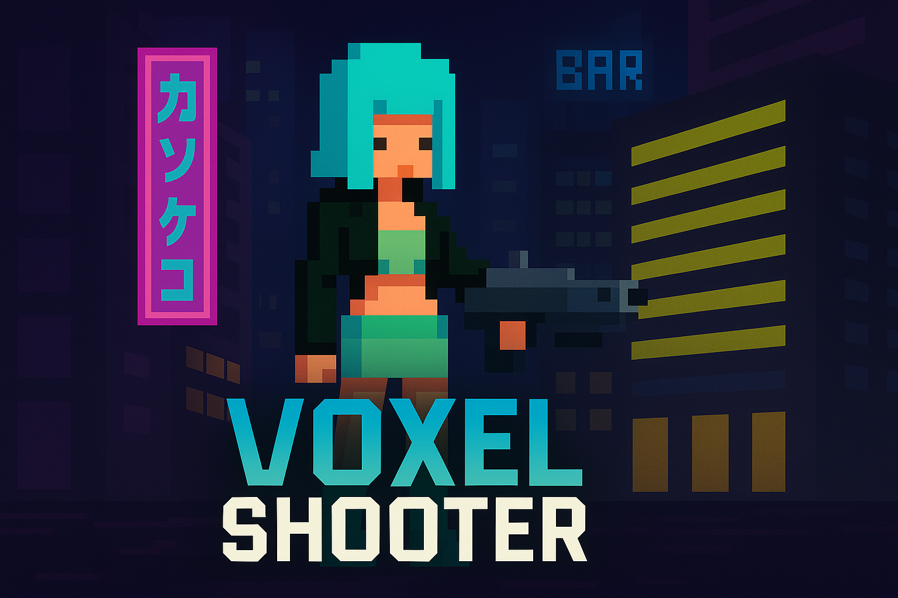
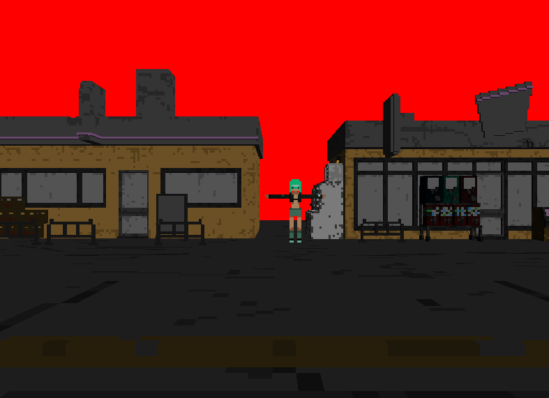

# Voxel Shooter

## Features
- 2D side-view with 3D/voxel-flavored assets and lighting
- Smooth camera with zoom in/out
- Movement, jump, and directional shield mechanic
- Basic level switching hook (door trigger) for multi-stage levels
- Lightweight custom mesh/material (.mds) format and exporter
- Uses OpenGL, SDL2, GLEW, and GLM; textures loaded via stb_image

## Controls
- A / D: Move left / right
- W / S: Zoom camera in / out
- SPACE: Jump
- F: Hold shield (directional; affects character facing)
- X: Reset camera
- Close window: Quit

Notes:
- Shield blocks movement while held; the character will turn toward the direction you are shielding (A or D + F).
- Movement boundaries per level are defined in code (see defines.h).

## Building
This project uses CMake and builds two targets: the game executable (opengl) and a model converter (modelexporter).

### Prerequisites
- C++14 compiler (GCC/Clang/MSVC)
- CMake 3.20+ (the script requests 4.0 but common 3.x works in most environments)
- OpenGL development libraries
- SDL2
- GLEW
- GLFW (linked; windowing is via SDL2, but GLFW is still required by CMakeLists)
- Assimp (for the modelexporter tool)
- GLM headers

On Debian/Ubuntu you can start with:
- sudo apt install build-essential cmake libsdl2-dev libglew-dev libglfw3-dev libassimp-dev libglm-dev

### Build from command line
- cmake -S . -B build -DCMAKE_BUILD_TYPE=Debug
- cmake --build build --target opengl
- cmake --build build --target modelexporter

Artifacts will be placed in the build directory (e.g., build/opengl, build/modelexporter).

### Build with CLion
- Open the project in CLion.
- Use the provided CMake profile and build the targets “opengl” and “modelexporter”.

## Running
- From CLion: run the target “opengl”.
- From command line: execute the built binary from a working directory where relative paths to assets resolve. When running from inside build/, you can run:
  - ./opengl

Important: The engine relies on relative paths defined in dir.h such as:
- shaders/basic.vs, shaders/basic.fs
- mds/level1/level1.mds, mds/level1/CyberpunkChar_0.mds
If you change where you run the binary from, update dir.h or adjust your working directory so these relative paths remain valid.

## Model Exporter (.mds)
The game reads a custom .mds format that packages mesh data and a minimal material block. Use the provided exporter to convert models supported by Assimp (OBJ/FBX/GLTF, etc.) to .mds.

Usage:
- ./modelexporter /path/to/model.obj

Behavior:
- Writes a .mds file next to the input with the same basename.
- Exports positions, normals, UVs, indices, and a compact material header (diffuse/specular/emissive/shininess and texture names when present).
- Place the resulting .mds file under the mds/ directory and update dir.h to point to it.

## Project layout (selected)
- main.cpp, control.cpp, level.cpp: runtime/game loop, input, level logic
- shader.h/.cpp, shaders/basic.vs, shaders/basic.fs: shader system and GLSL programs
- mesh.h, buffer.h, index_buffer.h, vertex_buffer.h: rendering buffers and mesh loading (.mds)
- model.cpp: Model rendering glue
- tools/modelexporter.cpp: Assimp-based converter to .mds
- texture/, assets/, mds/: textures, source assets, and exported meshes

## Troubleshooting
- Black screen or OpenGL errors:
  - Build in Debug and run from an IDE/terminal to see GL debug output (enabled by default in non-Release builds).
- Missing assets/shaders:
  - Ensure your working directory is the project root or the paths in dir.h are correct relative to the executable.
- Fullscreen vs. windowed:
  - The Release macro in defines.h toggles fullscreen/VSync and OpenGL debug. For development, keep Release undefined.

## License and assets
- Code license: Add your preferred license here (e.g., MIT). If you commit a LICENSE file, reference it.
- Third-party assets in assets/ and textures in texture/ may have their own licenses—ensure you have the rights to use and redistribute them.

## Roadmap ideas
- Combat and interaction systems
- Additional levels and doors
- Improved voxel rendering and post-processing
- Audio and UI

## Level

Template (copy and edit):
- Level <number>: <level-name>
  - Model: mds/level<number>/level<number>.mds
  - Character (if level-specific): mds/level<number>/CyberpunkChar_0.mds
  - Notes: <short description, doors/triggers, special mechanics>

Level:
- Level 1: World
  - Model: mds/level1/level1.mds
  - Notes: Mainlevel with doors and NPCs for the further levels.

- Level 2: Shop
  - Model: mds/level2/level2.mds
  - Notes: Here you can buy things like weapons, health stuff or skins.